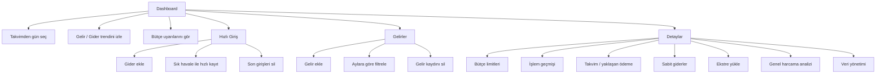
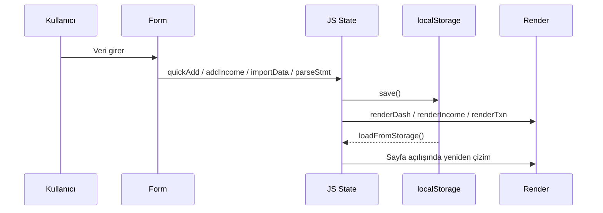
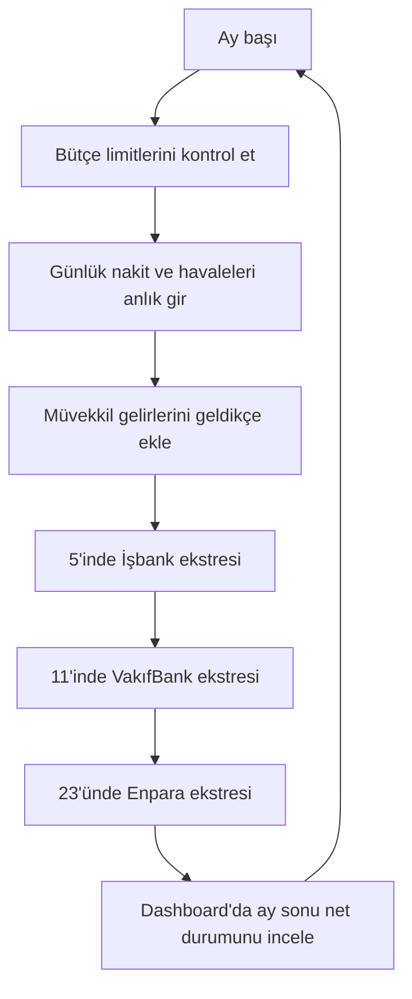
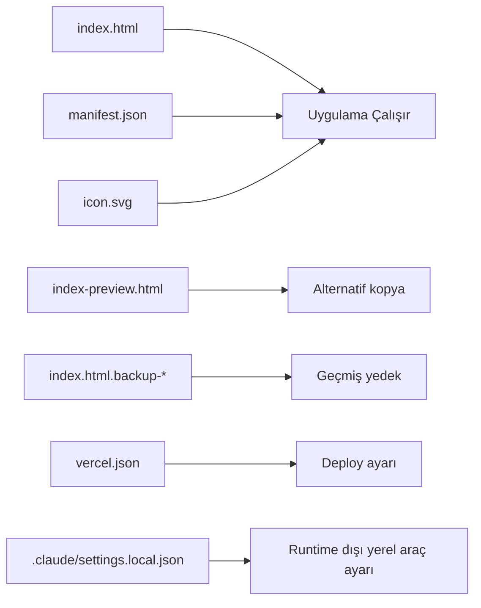

# Bütçe Takip Projesi Rehberi

Bu belge, `budget-tracker-main` projesinin mevcut kod tabanının okunmasıyla hazırlanmıştır. Rehber; projenin ne yaptığı, nasıl çalıştığı, hangi ekranların ne amaçla kullanıldığı, hangi verilerin ne zaman girildiği ve teknik mimarinin nasıl kurulduğunu açıklar.

## 1. Projenin Özeti

Bu proje, tek dosyalı bir kişisel bütçe ve gelir takip uygulamasıdır. Uygulama özellikle şu kullanım modeline göre tasarlanmış:

- Kişisel giderleri hızlıca kaydetmek
- Müvekkil / hukuk işi gelirlerini ayrı eklemek
- Son 6 aylık gider ve gelir eğilimini görmek
- Kategori bazlı aylık bütçe limitleri tanımlamak
- Gün bazlı takvim görünümünde kayıtları incelemek
- JSON yedeği almak ve geri yüklemek
- Banka ekstresini metin olarak yapıştırıp giderlere dönüştürmek
- Gemini ile tüm harcamaları analiz ettirmek

Önemli gerçek durum:

- Proje bir `SPA` ya da framework uygulaması değil; tek bir `index.html` içinde HTML + CSS + JavaScript barındırıyor.
- Veriler bir sunucuda değil, doğrudan tarayıcı `localStorage` içinde tutuluyor.
- Yani bu haliyle tek cihaz / tek tarayıcı mantığıyla çalışıyor.

## 2. Dosya Yapısı

Projede çalışma açısından esas alınan dosyalar şunlar:

| Dosya | Rolü |
| --- | --- |
| `index.html` | Uygulamanın tamamı. Tüm ekranlar, stiller ve JavaScript mantığı burada. |
| `index-preview.html` | `index.html` ile aynı içerikte görünen kopya. |
| `index.html.backup-20260416-210950` | Eski yedek sürüm. |
| `index.html.backup-before-swap-20260416-214040` | Eski yedek sürüm. |
| `manifest.json` | PWA benzeri metadata: isim, ikon, tema rengi, standalone görünüm. |
| `icon.svg` | Uygulama ikonu. |
| `vercel.json` | Vercel yönlendirme ayarı. |
| `.gitignore` | Git dışı bırakılan dosyalar. |
| `.claude/settings.local.json` | Yerel ajan / araç izin ayarı, uygulamanın çalışma mantığının parçası değil. |

Notlar:

- `index-preview.html`, `index.html` ile birebir aynı hash'e sahip.
- İki adet `backup` dosyası da kendi aralarında aynı içerikte, fakat aktif `index.html` sürümünden farklı.
- Çalışan uygulama esas olarak `index.html` üzerinden ilerliyor.

## 3. Teknoloji ve Çalışma Modeli

### Kullanılan teknoloji

- Saf HTML
- Saf CSS
- Saf JavaScript
- `Chart.js` CDN üzerinden yükleniyor
- Google Fonts CDN üzerinden yükleniyor
- Veri saklama için `localStorage`

### Build süreci var mı?

Hayır. Bu repo için:

- `package.json` yok
- npm/yarn/pnpm build adımı yok
- framework yok
- backend yok

Bu yüzden proje mantığı şu:

1. `index.html` açılır
2. Sayfa içindeki script çalışır
3. `localStorage` verisi okunur
4. Ekranlar JS ile render edilir
5. Form girişleri tekrar `localStorage`'a yazılır

## 4. Genel Mimari

```mermaid
flowchart LR
    K[Kullanıcı] --> UI[index.html Arayüzü]
    UI --> JS[JS Durum Yönetimi<br/>S nesnesi]
    JS --> SAVE[save()]
    SAVE --> LS[(localStorage)]
    LS --> LOAD[loadFromStorage()]
    LOAD --> JS
    JS --> DASH[Dashboard]
    JS --> QUICK[Hızlı Giriş]
    JS --> INC[Gelirler]
    JS --> MORE[Detaylar]
    UI --> CHART[Chart.js CDN]
    UI -. opsiyonel .-> AI[Gemini API<br/>Ekstre parse + analiz]
    UI --> FP[Yerel fallback parser<br/>Gemini hata verirse]
```

Bu mimaride merkezi veri yapısı `S` isimli state nesnesidir.

## 5. Uygulama Ekranları

Uygulama alt navigasyonda 4 ana hareket üzerinden ilerliyor:

- `Ana Sayfa` (`dash`)
- `Gelirler` (`income`)
- ortadaki FAB ile `Hızlı Giriş` (`quick`)
- `Detaylar` (`more`)
- ayrıca kısayol olarak `Bütçe` (`budget-shortcut`)

### Ekran akışı



## 6. Ana Fonksiyon Haritası

Kod tabanındaki ana işlevler:

| Fonksiyon | Ne yapar |
| --- | --- |
| `loadFromStorage()` | `localStorage` verisini yükler, ilk açılış seed verisini taşır. |
| `save()` | Gider, gelir ve bütçeleri `localStorage` içine kaydeder. |
| `renderDash()` | Dashboard ana görünümünü üretir. |
| `renderDashCalendar()` | Dashboard içi aylık takvimi üretir. |
| `renderDayList()` | Seçili günün gelir/gider listesini gösterir. |
| `quickAdd()` | Hızlı giriş ekranından gider kaydı ekler. |
| `favAdd()` | Sık havalelerden tek tıklamayla gider ekler. |
| `addIncome()` | Gelir kaydı ekler. |
| `renderBudget()` | Kategori bazlı bütçe ekranını üretir. |
| `renderTxn()` | Gider hareket geçmişini filtreli gösterir. |
| `renderCalendar()` | Detaylar içindeki ödeme takvimini üretir. |
| `renderFixed()` | Sabit gider listesini gösterir. |
| `saveGeminiKey()` | Gemini API anahtarını localStorage'a kaydeder. |
| `callGemini()` | Gemini `generateContent` API çağrısını yapar. |
| `parseStmt()` | Ekstreyi önce Gemini ile, hata olursa yerel parser ile içe aktarır. |
| `parseStatementFallback()` | Metin satırlarından tarih / tutar / açıklama çıkaran yerel fallback parser. |
| `analyzeAllSpending()` | Son 6 ay gider, gelir ve bütçe verisini Gemini ile yorumlatır. |
| `exportData()` | JSON yedeği indirir. |
| `importData()` | JSON yedeğini geri yükler. |
| `resetAll()` | Tüm verileri sıfırlar. |
| `reseedDemo()` | Demo verilerini tekrar ekler. |

## 7. Veri Modeli

### 7.1 Gider kaydı yapısı

Her gider kaydı şu formda tutuluyor:

```json
{
  "id": "benzersiz-id",
  "d": "2026-04-20",
  "desc": "Hebun Çorba",
  "cat": "yemek",
  "amt": 250,
  "bank": "Nakit"
}
```

Alanlar:

- `id`: benzersiz kayıt kimliği
- `d`: tarih
- `desc`: açıklama
- `cat`: gider kategorisi
- `amt`: tutar
- `bank`: kaynak / hesap / ödeme tipi

### 7.2 Gelir kaydı yapısı

```json
{
  "id": "benzersiz-id",
  "d": "2026-04-20",
  "desc": "Müvekkil tahsilatı",
  "amt": 15000,
  "cat": "tahsilat",
  "bank": "Enpara"
}
```

### 7.3 Bütçe yapısı

Bütçeler nesne olarak saklanıyor:

```json
{
  "kira": 8500,
  "muhasebe": 2750,
  "spor": 1500,
  "fatura": 6000
}
```

Yani kategori kodu -> aylık limit eşleşmesi var.

## 8. Kategori Sistemi

### 8.1 Gider kategorileri

Projede tanımlı gider kategorileri:

- `kira`
- `muhasebe`
- `spor`
- `fatura`
- `dijital`
- `market`
- `yemek`
- `eticaret`
- `ulasim`
- `saglik`
- `egitim`
- `eglence`
- `giyim`
- `yatirim`
- `vergi`
- `uyap`
- `nakit`
- `diger`

### 8.2 Gelir kategorileri

- `tahsilat`
- `vekalet`
- `danismanlik`
- `avans`
- `diger-gelir`

### 8.3 Önemli iş kuralı

`UYAP` kategorisi kişisel harcama gibi değerlendirilmiyor.

Kodda:

- Dashboard'daki kişisel gider hesabına `uyap` dahil edilmiyor
- Net bakiye hesabında kişisel gider tarafında `uyap` hariç tutuluyor
- `UYAP` ayrıca “mesleki / müvekkil gideri” gibi ayrı metrikte gösteriliyor

Bu, uygulamanın kişisel harcama ile mesleki ödeme kalemini ayırmaya çalıştığını gösteriyor.

## 9. localStorage Anahtarları

Uygulama verileri şu anahtarlarla tutuluyor:

| Key | İçerik |
| --- | --- |
| `ay_exp` | Gider kayıtları |
| `ay_inc` | Gelir kayıtları |
| `ay_bud` | Bütçe limitleri |
| `ay_seed_migrated` | Demo verisinin ilk taşınma işareti |
| `ay_theme` | Seçili tema |
| `ay_gemini_key` | Gemini API anahtarı |

### Veri yaşam döngüsü



## 10. İlk Açılışta Ne Olur?

Bu proje için en kritik davranışlardan biri şu:

- Uygulama ilk açıldığında demo / seed verisi otomatik olarak `localStorage` içine taşınıyor.
- Yani kullanıcı daha hiçbir veri girmeden örnek geçmiş kayıtlar görebiliyor.

Bu seed veri:

- son 6 aylık düzenli gider örnekleri
- kira
- muhasebe
- spor
- nakit
- çeşitli geçmiş gider örnekleri

Bu yüzden projeyi gerçek kullanım için devralan kişinin ilk yapması gereken kontrol:

1. Eğer demo verilerle başlamak istemiyorsa `Detaylar > Veri > Tüm Verileri Sıfırla`
2. Ardından kendi gerçek kayıtlarıyla devam etmek

## 11. Dashboard Nasıl Çalışıyor?

Dashboard ekranı projenin ana karar ekranı.

Gösterdikleri:

- seçili aya ait net bakiye
- seçili ay gelir toplamı
- seçili ay gider toplamı
- 30.000 TL hedefe kalan / aşan durum
- takvim görünümü
- gün seçildiğinde o güne ait kayıtlar
- detay panelinde bugünkü / haftalık / aylık gider pulse
- 6 aylık gelir-gider trend grafiği
- aylık net P&L tablosu
- bütçe aşımlarına dair uyarılar

### Dashboard hesap mantığı

- `monthI(m)`: seçili ayın gelir toplamı
- `monthP(m)`: seçili ayın gider toplamı, ama `uyap` hariç
- `monthNet = monthI - monthP`
- hedef: `GOAL = 30000`

Yani dashboard kişisel gider hedefi mantığıyla kurulmuş.

## 12. Hızlı Giriş Ekranı Nasıl Kullanılır?

Bu ekran anlık gider girmek için tasarlanmış.

Kullanıcıdan beklenen veri:

- `Tutar`
- `Açıklama / Kime / Nerede`
- `Tarih`
- `Kaynak`
- `Kategori`

Kaynak seçenekleri:

- `Havale`
- `Nakit`
- `İşbank`
- `Enpara`
- `VakıfBank`

Bu ekranda iki önemli kullanım şekli var:

### 12.1 Normal manuel giriş

Örnek:

- 250 TL yemek
- 1200 TL market
- 350 TL halısaha
- 5000 TL kira

### 12.2 Sık havaleler

Ön tanımlı hızlı kayıtlar var:

- İbrahim Yaman
- Metin Sağır
- Tuğay Tuna
- Ahmet Korkmaz

Bunlara tıklanınca ilgili gider bugünün tarihiyle tek hamlede ekleniyor.

## 13. Gelir Ekranı Nasıl Kullanılır?

Bu ekran müvekkil / iş kaynaklı gelirleri eklemek için.

Girilen alanlar:

- tarih
- tutar
- müvekkil / açıklama
- gelir kategorisi
- hesap

Gelir kategorileri:

- UYAP tahsilatı
- vekalet ücreti
- danışmanlık
- dava avansı
- diğer gelir

Bu ekranın amacı, gider girişinden bağımsız şekilde para girişini takip etmek.

## 14. Detaylar Ekranı Ne Sunuyor?

### 14.1 Bütçe

Bu sekmede kategori bazlı limitler belirleniyor.

Sistem ne yapıyor:

- her kategori için bütçe limiti gösteriyor
- son 3 ay ortalamasını hesaplıyor
- limit / ortalama oranını yüzde olarak veriyor
- renkli uyarı mantığı kuruyor

Uyarı seviyeleri:

- `%70+` dikkat
- `%90+` yüksek risk
- `%100+` aşım

Not:

- Bütçe hesaplarında `uyap` ve `diger` dışarıda tutulmuş.

### 14.2 İşlemler

Bu alan tüm gider hareket geçmişini listeliyor.

Filtreler:

- ay filtresi
- kategori filtresi

Buradan:

- geçmiş kayıtlar incelenebilir
- kayıt silinebilir

### 14.3 Takvim

Bu sekme, ödeme operasyonunu planlama amaçlı tasarlanmış.

Ekranda:

- sabit takvim olayları
- yaklaşan ödeme kartları
- “Ekstre İş Akışı” metni

Bulunan sabit iş akışı:

- `5'i` -> İşbank ekstresi yapıştır
- `11'i` -> VakıfBank ekstresi yapıştır
- `23'ü` -> Enpara ekstresi yapıştır
- `Her zaman` -> Nakit + havaleler anlık gir

Bu bilgi, projenin hedeflenen gerçek kullanım rutinini doğrudan anlatıyor.

### 14.4 Sabit Giderler

Bu sekmede tahmini sabit gider listesi var:

- ev kirası
- ofis kirası
- halısaha
- muhasebe
- pazar alışverişi
- ofis fatura payı
- ev fatura paketi
- dijital abonelikler

Bu alan şu anda referans / görünüm amaçlı; ayrı veri tablosu olarak düzenlenmiyor.

### 14.5 Ekstre Yükle

Amaç:

- Gemini API anahtarını tanımlamak
- banka ekstresi metnini yapıştırmak
- bankayı seçmek
- işlem satırlarını Gemini ile parse ettirmek
- Gemini hata verirse yerel parser ile satırları ayıklamak
- çıkan işlemleri gider listesine eklemek
- tüm harcamalar için ayrı bir AI analizi almak

Seçilebilir bankalar:

- İşbank
- VakıfBank
- Enpara

Bu alandaki güncel akış:

1. Kullanıcı `Gemini API Key` alanına kendi anahtarını yapıştırır.
2. Ekstre metni metin kutusuna yapıştırılır.
3. `Gemini ile Analiz Et` butonu önce Gemini API'ye gider.
4. Gemini geçerli JSON döndürürse işlemler doğrudan gider listesine eklenir.
5. Gemini hata verirse veya sonuç üretemezse yerel fallback parser devreye girer.
6. Fallback parser satır satır tarih, açıklama ve tutar ayıklamaya çalışır.
7. Çıkan kayıtlar aylık harcamalara eklenir.

Yerel fallback parser'ın yaptığı şey:

- `dd.mm.yyyy`, `dd/mm/yyyy`, `yyyy-mm-dd` gibi tarihleri yakalamak
- satırdaki son para değerini tutar kabul etmek
- açıklamaya göre kategori tahmini yapmak
- `iade`, `iptal`, `gelen havale`, `bakiye`, `toplam` gibi satırları atlamak

Bu yüzden mevcut sistem iki modda çalışır:

- `Gemini modu`: daha esnek ve daha iyi kategori yorumlama yapabilir
- `Fallback modu`: AI çalışmasa bile temiz ekstre satırlarını yine içe aktarır

Notlar:

- PDF dosyası doğrudan yüklenmiyor; PDF'den kopyalanmış `düz metin` bekleniyor
- API anahtarı tarayıcı `localStorage` içinde tutuluyor
- Genel harcama analizi butonu veri eklemez, sadece yorum üretir

### 14.6 Genel Harcama Analizi

Bu alan, son 6 ayın giderlerini, gelirlerini, bütçelerini ve büyük harcamalarını Gemini ile yorumlar.

Çıktı türü:

- genel finansal durum
- en fazla para yakan kalemler
- riskler
- gelecek ay için net öneriler

Bu özellik:

- yeni kayıt eklemez
- mevcut veriyi değiştirmez
- sadece karar desteği sağlar

### 14.7 Veri

Buradan yapılabilenler:

- JSON yedeği almak
- JSON yedeği yüklemek
- tüm verileri sıfırlamak
- demo verileri tekrar eklemek

## 15. Hangi Veri Ne Zaman Girilir?

Bu proje için en doğru kullanım takvimi aşağıdaki gibi.

| Zaman | Girilecek veri | Hangi ekran |
| --- | --- | --- |
| Anlık / aynı gün | Nakit harcama | `Hızlı Giriş` |
| Anlık / aynı gün | Havale ile ödenen gider | `Hızlı Giriş` |
| Ödeme olur olmaz | Müvekkil tahsilatı / vekalet / danışmanlık geliri | `Gelirler` |
| İlk kurulumda bir kez | Gemini API anahtarı | `Detaylar > Ekstre Yükle` |
| Ay başı veya alışkanlık değişince | Kategori bütçe limitleri | `Detaylar > Bütçe` |
| Her ay 5'i | İşbank kart / hesap ekstresi | `Detaylar > Ekstre Yükle` |
| Her ay 11'i | VakıfBank ekstresi | `Detaylar > Ekstre Yükle` |
| Her ay 23'ü | Enpara ekstresi | `Detaylar > Ekstre Yükle` |
| Haftalık / aylık kontrol | Günlük ve aylık toplamları inceleme | `Dashboard` |
| Ay kapanışında veya ihtiyaç halinde | Genel finansal yorum | `Detaylar > Ekstre Yükle > Genel Harcama Analizi` |
| İhtiyaç halinde | JSON yedeği alma | `Detaylar > Veri` |

### Veri giriş politikası

Bu projede çifte kayıt oluşturmamak için en mantıklı operasyon şu:

- `Nakit` ve `Havale` işlemlerini anında manuel gir
- Banka ekstresinden gelecek kart / hesap hareketlerini toplu ekle
- Aynı işlemi hem anlık hem ekstre ile ikinci kez ekleme
- Ekstre içe aktarma öncesi mümkünse metni temiz tut; fallback parser temiz satırlarda daha iyi sonuç verir

## 16. Projenin Aylık Operasyon Diyagramı



## 17. 6 Aylık Pencere Mantığı

Kod, sabit bir yıllık rapor yerine hareketli 6 aylık pencere kullanıyor.

Bu şu anlama geliyor:

- içinde bulunulan ay her zaman son slot
- önceki 5 ay da birlikte gösteriliyor
- grafikler ve filtreler bu pencere üzerinden çalışıyor

Son 3 ay ortalaması hesabı da bu 6 aylık pencerenin son 3 ayına göre yapılıyor.

## 18. Seed / Demo Veri Mantığı

Projede `buildSeed()` ile büyük bir örnek veri seti oluşturuluyor.

Bu veri:

- düzenli tekrar eden giderleri
- farklı kategori örneklerini
- geçmiş ay örneklerini
- bütçe görselleştirme için dolu veri setini

sağlıyor.

Bu yaklaşım demo açısından iyi, ama canlı kullanımda şu sonucu doğuruyor:

- ilk kurulumda veri tabanı boş başlamıyor

Bu yüzden gerçek kullanıma alınacaksa:

1. ya ilk açılış seed davranışı kapatılmalı
2. ya kullanıcı rehberde bunun farkında olmalı

## 19. Mevcut Dosyaların Gerçek Etki Alanı



Pratikte çalışan dosyalar:

- `index.html`
- `manifest.json`
- `icon.svg`

## 20. Projenin Güçlü Tarafları

- Çok hızlı açılan hafif yapı
- Kurulum gerektirmemesi
- Tek dosyada kolay taşınabilirlik
- Günlük kullanım için hızlı giriş akışı
- Bütçe + gelir + işlem + takvim görünümünü tek yerde toplaması
- JSON yedekleme desteği
- Gemini ile ekstre parse ve genel harcama yorumu
- Gemini başarısız olduğunda çalışan yerel fallback içe aktarma

## 21. Tespit Edilen Kısıtlar ve Teknik Riskler

### 21.1 Backend yok

Sonuç:

- veriler sadece tek tarayıcıda tutulur
- cihaz değişince otomatik senkron gelmez
- tarayıcı verisi silinirse veri kaybı olur

### 21.2 API anahtarı tarayıcı tarafında tutuluyor

Mevcut kodda:

- Gemini API çağrısı doğrudan tarayıcıdan yapılıyor
- kullanıcı kendi API anahtarını forma yapıştırıyor
- anahtar `localStorage` içine yazılıyor

Sonuç:

- kişisel kullanım için pratik
- ama üretim ortamı için güvenlik açısından ideal değil
- daha doğru çözüm backend proxy kullanmak olur

### 21.3 Fallback parser kusursuz değil

Yerel parser:

- temiz satır bazlı ekstrelerde iyi çalışır
- bozuk OCR çıktısında yanlış açıklama veya yanlış kategori üretebilir
- çok sütunlu / dağınık PDF kopyalarında eksik kayıt çıkarabilir

### 21.4 Vercel ayarı repo yapısıyla uyumsuz görünüyor

`vercel.json` içinde tüm route'lar `/public/$1` altına gönderiliyor. Fakat projede `public/` klasörü yok.

Bu yüzden:

- mevcut deploy ayarı bu repo yapısıyla hatalı olabilir

### 21.5 PWA tam değil

`manifest.json` var ama service worker yok.

Sonuç:

- uygulama PWA benzeri görünüm alabilir
- ama gerçek offline-first deneyim yok

### 21.6 Detay Takvim ekranı dinamik değil

`renderCalendar()` fonksiyonunda takvim `Nisan 2026` için sabitlenmiş durumda.

Sonuç:

- bu bölüm gerçek zamanlı genel takvim değil
- operasyon paneli / prototip görünümü gibi davranıyor

## 22. Gerçek Kullanım Senaryosu

Projeyi gerçek hayatta kullanmanın en mantıklı sırası:

1. Uygulamayı aç
2. Demo veriler istenmiyorsa temizle
3. Bütçe limitlerini kendi yaşamına göre güncelle
4. Günlük nakit ve havale harcamalarını `Hızlı Giriş` ile kaydet
5. Gelir geldikçe `Gelirler` ekranına işle
6. Bir kez Gemini API anahtarını `Detaylar > Ekstre Yükle` alanına yapıştır
7. Ay içinde dashboard üzerinden durumunu izle
8. Belirli ekstre günlerinde toplu banka hareketlerini içeri al
9. Ay sonunda `Genel Harcama Analizi` ile yorumu incele
10. `Dashboard` ve `İşlemler` sekmesinden kontrol yap
11. Düzenli olarak JSON yedeği indir

## 23. Geliştirici İçin Kısa Özet

Bu repo bir “tek HTML dosyasında finans takip uygulaması” yapısıdır.

Temel gerçekler:

- framework yok
- component sistemi yok
- state merkezi `S` nesnesinde
- veri kalıcılığı `localStorage`
- render fonksiyonları DOM'u yeniden üretme mantığıyla çalışıyor
- Gemini entegrasyonu doğrudan browser-side REST çağrısıyla yapılıyor
- ekstre içe aktarmada AI başarısız olursa yerel parser fallback'i var
- iş akışı ağırlıklı olarak hukuk / müvekkil gelirleri + kişisel giderler odağında

## 24. Sonuç

Bu proje, kişisel giderler ile hukuk işi gelirlerini aynı arayüzde tutmaya çalışan, hızlı kullanım odaklı, tek dosyalı bir finans takip uygulamasıdır.

En kritik çalışma mantığı şudur:

- kişisel giderler hızlı girilir
- gelirler ayrı kaydedilir
- UYAP türü mesleki ödemeler ayrı izlenir
- bütçeler kategori bazında yönetilir
- veriler tarayıcıda saklanır
- ekstre içe aktarma artık Gemini + fallback parser hibrit yapısıyla çalışır
- aylık operasyon mantığı ekstre günleri + anlık manuel girişler üzerine kuruludur

Eğer istersen bir sonraki adımda bunun üstüne ayrıca:

- teknik mimari şeması daha da detaylı bir `DIAGRAM.md`
- veri modeli için `SCHEMA.md`
- kullanıcı odaklı kısa versiyon `KULLANIM.md`

da çıkarabilirim.
